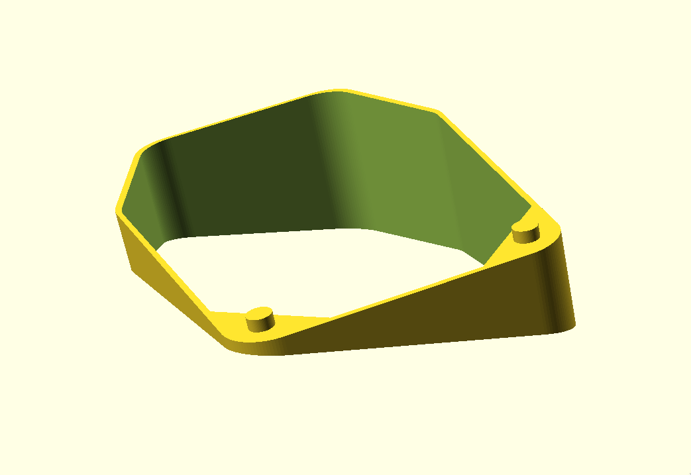
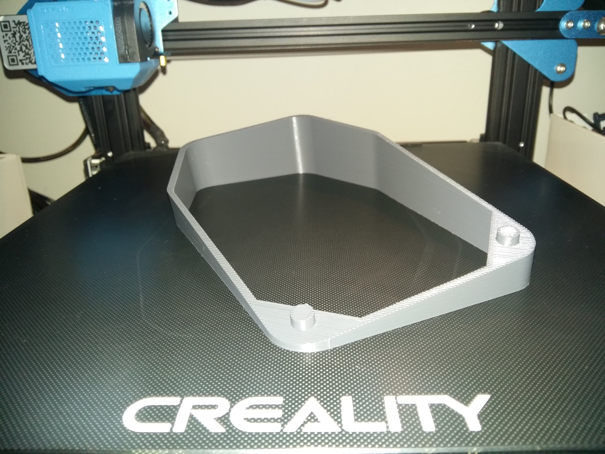
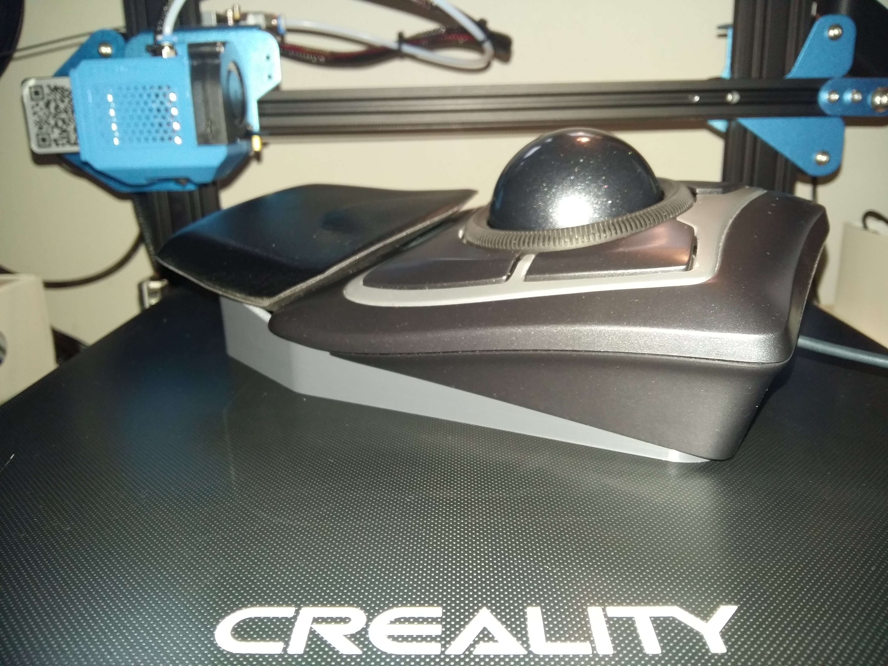
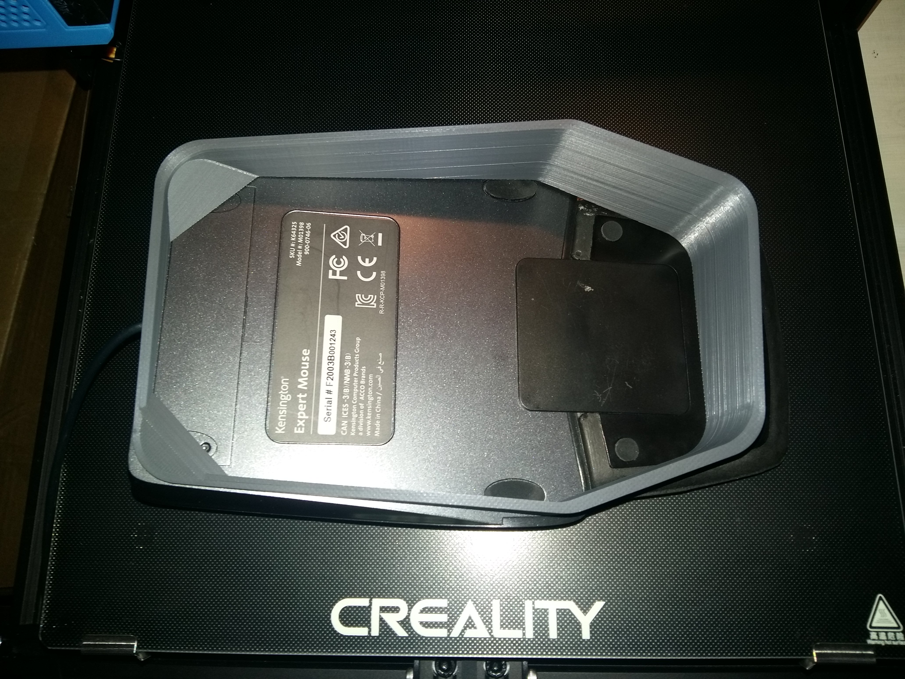
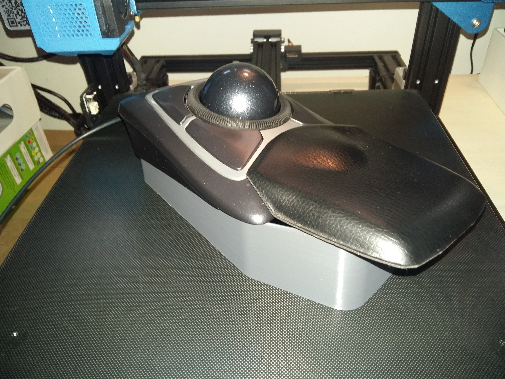
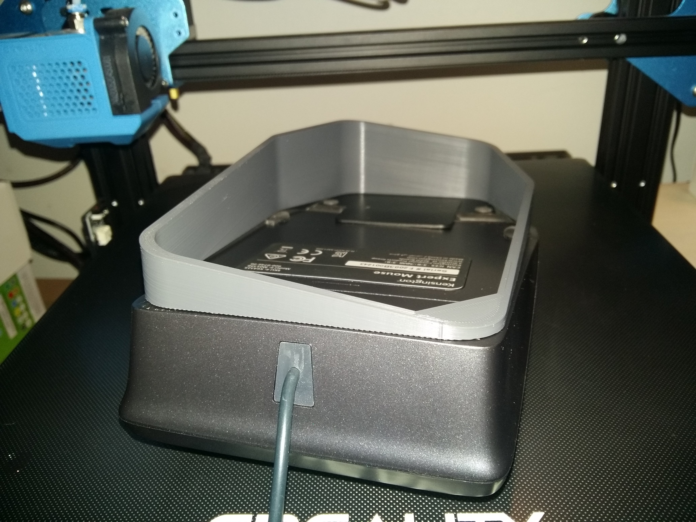

# Tenting spacer for Kensington Expert Trackball

Parametric tenting spacer to adjust the roll and pitch of the Kensington
Expert Trackball.

*Preview of 8° roll, -8° pitch with wrist rest support enabled.*

## Customization

The model is built with OpenSCAD which is a software for creating
parametric, solid 3D CAD objects using programming. Configure the model
parameters as you please, then export the desired model into a STL file
for 3D printing.

The following parameters can be changed using the customizer in
OpenSCAD:

- **Wrist rest** - Whether or not to include support for wrist rest.
- **Roll angle** - Side-to-side angle of the spacer.
- **Pitch angle** - Back/forth angle of the spacer.
- **Base height** - Height of lowest point from the surface.
- **Wall thickness** - Useful for 3D printing.

## 3D printing

STL file of default model is available in the [stl/](./stl) directory. I
don't recommend using it. You should customize the model to fit *you*.

- Material: PLA
- 40% infill (may work with less)
- No supports

Printing time approx 6h 15m with 50mm/s speed, 200mm/s travel.

## Images

