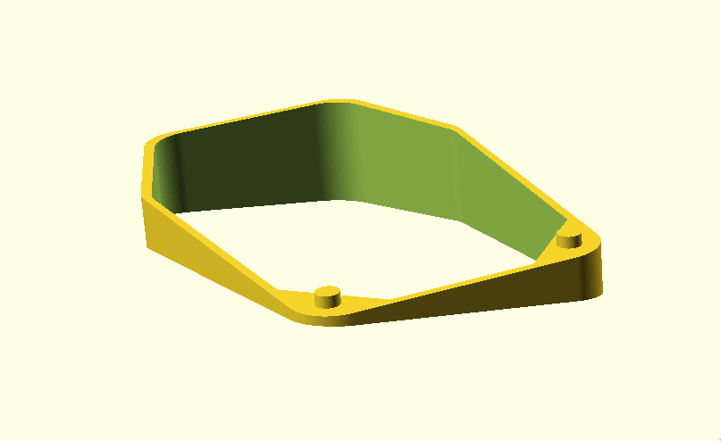

# Tenting spacer for Kensington Expert Trackball

Parametric tenting spacer to adjust the roll and pitch of the Kensington
Expert Trackball.

*Preview of 15° roll, -10° pitch with wrist rest support.*

## Customization

The following parameters can be changed using the customizer in
OpenSCAD:

- **Wrist rest** - Whether or not to include support for wrist rest.
- **Roll angle** - Side-to-side angle of the spacer.
- **Pitch angle** - Back/forth angle of the spacer.
- **Base height** - Height of lowest point from the surface.
- **Wall thickness** - Useful for 3D printing.

## 3D printing

*TBD print settings*
